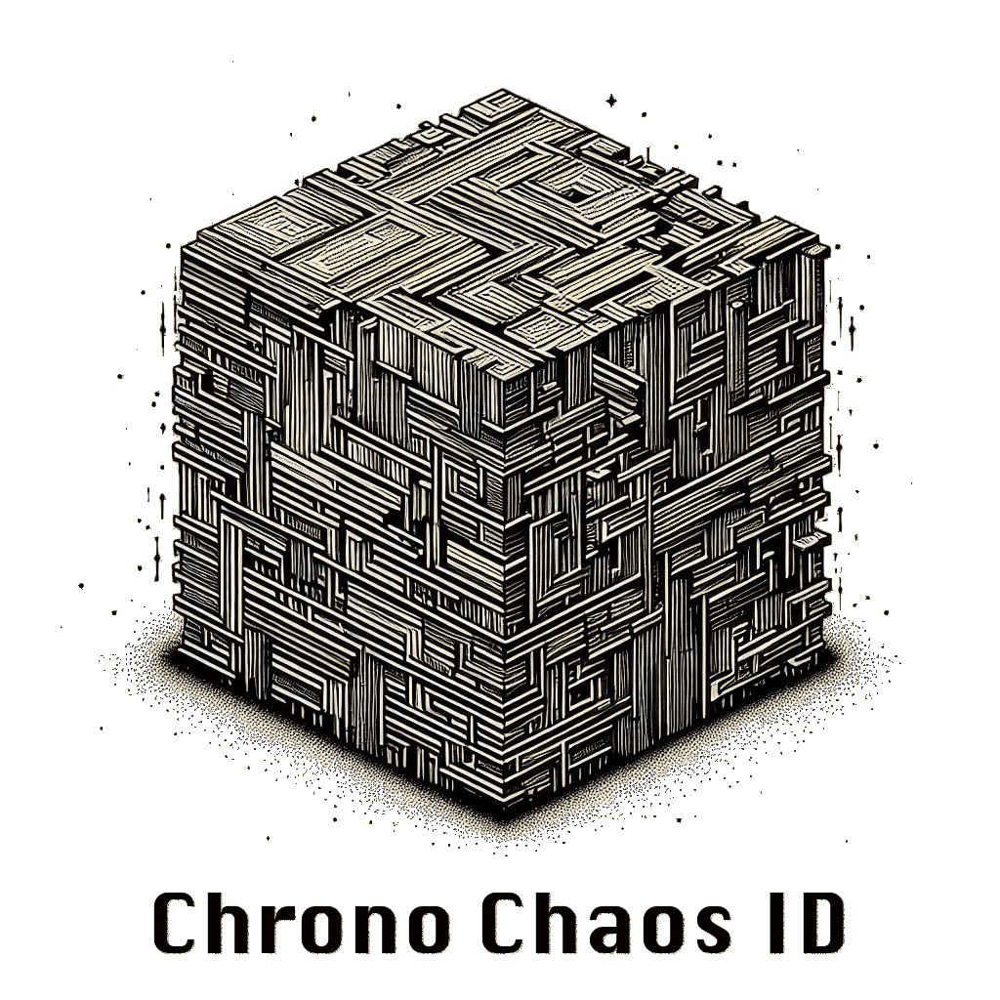

# CCID: Chrono Chaos ID Generator

Family of ID generators with varied sizes for different entities, addressing efficiency, storage, and security concerns

* Lexicographically sortable, time stored as a BigEndian
* Epoch based, continuously growing
	* 32-bit, 1-second precision,  (like in [KSUID](https://github.com/segmentio/ksuid)or [ObjectID](https://docs.mongodb.com/manual/reference/method/ObjectId/))
	* Not guarantee correct timestamp, due to possible overflow
	* Minimize Side-channel attacks by low-time precision
* Random part as big as possible to minimize [Birthday Problem](https://en.wikipedia.org/wiki/Birthday_problem)
* Monotonic in single time tick, increase by random number (50% of random bits size)
	* Overflow in random bits will increase time (+1) and generate new random part
	* No errors or exceptions
* Verity of ID sizes
	* 64 bits
	* 96 bits
	* 128 bits
	* 160 bits
	* minimize foreign key overhead in disk size and usage speed
* Optional Fingerprint with variable size
	* 64 bits - 8 bits, decrease random part to 24 bits
	* rest sizes - 8 - 40 bits

> Fingerprint generation should be part of the consumer solution, which can be centralizer, or distributed. Based on [SHA-3 / SHAKE256](https://en.wikipedia.org/wiki/SHA-3)

* Support different formats for serialization and parsing
	* Binary byte array
	* Hex
	* Crockford's base32
	* Base62 (not Base64), 15% smaller then base32, default representation
		* avoid dashes
		* [A brief history of the UUID](https://segment.com/blog/a-brief-history-of-the-uuid/)
    
> hen UUIDs are indexed by a search engine, where the dashes will likely be interpreted as token delimiters. The base62 encoding avoids this pitfall and retains the lexicographic ordering properties of the binary encoding.

Optional compatibility:
* 64 bits - uint64
* 96 bits - ObjectId
* 128 bit - UUID v8
* 160 bit - KSUID

## Storage size

| Size               | Hex (`4 bits`) | Base32 (`5 bits`) | Base62 (`5.8125 bits`) |  Binary, bytes   | UUID string |
| ------------------ |:--------------:|:-----------------:|:----------------------:|:---:|:-----------:|
| 64 bit   |       16       |        13         |           11           |  8   |             |
| 96 bit  |       24       |        20         |           17           |  12   |             |
| 128 bit |       32       |        26         |           22           |  16   |     36      |
| 160 bit |       40       |        32         |           27           |  20   |             |

## Variations

#### No Fingerprint

| Type     | Time | Random part | IDs1 (p = 1 × 10⁻⁰⁶) |  IDs2   | 
|:-------- |:---------:|:-----------:|:------------------------------------------------------:|:---:|
| 64 bits  |  32 bits  |   32 bits   |                         92                          |  ~ 6.6 × 10⁰⁴   |
| 96 bits  |  32 bits  |   64 bits   |                       ~ 6 × 10⁰⁶                       | ~ 4.3 × 10⁰⁹    |
| 128 bits |  32 bits  |   96 bits   |                       ~ 4 × 10¹¹                       |  ~ 2.8 × 10¹⁴   |
| 160      |  32 bits  |  128 bits   |                      ~ 2.6 × 10¹⁶                      | ~ 1.8 × 10¹⁹    |

1 IDs in one time tick. Parallel, independent generation

2 IDs in one time tick. Single-place generation, monotonic

#### With Fingerprint

| Type     |  Time   | Fingerprint |  Random part  | IDs3 (p = 1 × 10⁻⁰⁶) | IDs 4 |
|:-------- |:-------:|:-----------:|:-------------:|:------------------------------------------------------:|:---------------------------------------:|
| 64 bits  | 32 bits |   8 bits    |    24 bits    |                           5                            |               ~ 4.1 × 10⁰³                |
| 96 bits  | 32 bits | 8 - 40 bits | 56 - 24 bits  |                 3.8 × 10⁰⁵ ⇒ 5                  |          2.7 × 10⁰⁸ ⇒ 4.1 × 10⁰³          |
| 128 bits | 32 bits | 8 - 40 bits | 88 - 56 bits  |                 2.5 × 10¹⁰ ⇒ 3.8 × 10⁰⁵                  |         1.8 × 10¹³ ⇒ 2.7 × 10⁰⁸         |
| 160 bits | 32 bits | 8 - 40 bits | 120 - 88 bits |                 1.6 × 10¹⁵ ⇒ 2.5 × 10¹⁰                  |         1.2 × 10¹⁸ ⇒ 1.8 × 10¹³         |

3 IDs in one time tick. Random fingerprint related to the process/client might be the same.  
Parallel, independent generation.

4 IDs in one time tick. Fingerprint separate different generations,
considered add of random number (50% of random bits size)

## Byte schema

* `t` - 8 bits of the timestamp
* `r` - 8 bits of random bits
* `F` - 8 bits of fingerprint

| Type     |         No fingerprint |        MIN fingerprint |        MAX fingerprint |
|:-------- | :----------------------|:----------------------|:----------------------|
| 64 bits  |             `ttttrrrr` |             `ttttFrrr` |             `ttttFrrr` |
| 96 bits  |         `ttttrrrrrrrr` |         `ttttFrrrrrrr` |         `ttttFFFFFrrr` |
| 128 bits |       `ttttrrrrrrrrrrrr` |       `ttttFrrrrrrrrrrr` |       `ttttFFFFFrrrrrrr` |
| 160      | `ttttrrrrrrrrrrrrrrrr` | `ttttFrrrrrrrrrrrrrrr` | `ttttFFFFFrrrrrrrrrrr` |

## Birthday Problem probability

Results values divided adjusted to milliseconds precision

#### Random bits collision estimation

| Random bits | `1 × 10⁻⁰⁹` (0.0000001%) | `1 × 10⁻⁰⁶` (0.0001%) * | `0.001` (0.1%) | `0.01` (1.0%) | `0.25` (25.0%) | `0.5` (50.0%) |
| -----------:|:------------------------:|:---------------------:|:--------------:|:-------------:|:--------------:| ------------- |
|     24 bits |          `1.0`           |         **5.8**         |    `183.2`     |    `580.7`    |   `3,106.9`    | `4,822.7`     |
|     32 bits |          `2.9`           |        **92.7**         |   `2,931.6`    |   `9,291.5`   |   `5 × 10⁰⁴`   | `7.7 × 10⁰⁴`  |
|     40 bits |          `46.9`          |       `1,482.9`       |  `4.7 × 10⁰⁴`  | `1.5 × 10⁰⁵`  |   `8 × 10⁰⁵`   | `1.2 × 10⁰⁶`  |
|     48 bits |         `750.3`          |     `2.4 × 10⁰⁴`      |  `7.5 × 10⁰⁵`  | `2.4 × 10⁰⁶`  |  `1.3 × 10⁰⁷`  | `2 × 10⁰⁷`    |
|     56 bits |       `1.2 × 10⁰⁴`       |     **3.8 × 10⁰⁵**      |  `1.2 × 10⁰⁷`  | `3.8 × 10⁰⁷`  |   `2 × 10⁰⁸`   | `3.2 × 10⁰⁸`  |
|     64 bits |       `1.9 × 10⁰⁵`       |     `6.1 × 10⁰⁶`      |  `1.9 × 10⁰⁸`  | `6.1 × 10⁰⁸`  |  `3.3 × 10⁰⁹`  | `5.1 × 10⁰⁹`  |
|     72 bits |       `3.1 × 10⁰⁶`       |     `9.7 × 10⁰⁷`      |  `3.1 × 10⁰⁹`  | `9.7 × 10⁰⁹`  |  `5.2 × 10¹⁰`  | `8.1 × 10¹⁰`  |
|     80 bits |       `4.9 × 10⁰⁷`       |     `1.6 × 10⁰⁹`      |  `4.9 × 10¹⁰`  | `1.6 × 10¹¹`  |  `8.3 × 10¹¹`  | `1.3 × 10¹²`  |
|     88 bits |       `7.9 × 10⁰⁸`       |     **2.5 × 10¹⁰**      |  `7.9 × 10¹¹`  | `2.5 × 10¹²`  |  `1.3 × 10¹³`  | `2.1 × 10¹³`  |
|     96 bits |       `1.3 × 10¹⁰`       |      `4 × 10¹¹`       |  `1.3 × 10¹³`  |  `4 × 10¹³`   |  `2.1 × 10¹⁴`  | `3.3 × 10¹⁴`  |
|    104 bits |        `2 × 10¹¹`        |     `6.4 × 10¹²`      |   `2 × 10¹⁴`   | `6.4 × 10¹⁴`  |  `3.4 × 10¹⁵`  | `5.3 × 10¹⁵`  |
|    112 bits |       `3.2 × 10¹²`       |      `1 × 10¹⁴`       |  `3.2 × 10¹⁵`  |  `1 × 10¹⁶`   |  `5.5 × 10¹⁶`  | `8.5 × 10¹⁶`  |
|    120 bits |       `5.2 × 10¹³`       |     **1.6 × 10¹⁵**      |  `5.2 × 10¹⁶`  | `1.6 × 10¹⁷`  |  `8.7 × 10¹⁷`  | `1.4 × 10¹⁸`  |
|    128 bits |       `8.2 × 10¹⁴`       |     `2.6 × 10¹⁶`      |  `8.3 × 10¹⁷`  | `2.6 × 10¹⁸`  |  `1.4 × 10¹⁹`  | `2.2 × 10¹⁹`  |

* Highlighted in bold fingerprint edge cases

#### Probability of duplication for ID generated in same time tick, no monotonicity

| Random bits |    100 IDs    |   1,000 IDs   |  10,000 IDs   |  100,000 IDs  | 1 × 10⁰⁶ IDs  | 1 × 10⁰⁷ IDs  |
| -----------:|:-------------:|:-------------:|:-------------:|:-------------:|:-------------:|:-------------:|
|     24 bits |   `0.00030`   |   `0.02936`   |   `0.94922`   |      `1`      |      `1`      |      `1`      |
|     32 bits | `1.2 × 10⁻⁰⁶` |   `0.00012`   |   `0.01157`   |   `0.68781`   |      `1`      |      `1`      |
|     40 bits | `4.5 × 10⁻⁰⁹` | `4.5 × 10⁻⁰⁷` |   `0.00005`   |   `0.00454`   |   `0.36539`   |      `1`      |
|     48 bits | `1.8 × 10⁻¹¹` | `1.8 × 10⁻⁰⁹` | `1.8 × 10⁻⁰⁷` |   `0.00002`   |   `0.00177`   |   `0.16275`   |
|     56 bits | `6.9 × 10⁻¹⁴` | `6.9 × 10⁻¹²` | `6.9 × 10⁻¹⁰` | `6.9 × 10⁻⁰⁸` | `6.9 × 10⁻⁰⁶` |   `0.00069`   |
|     64 bits | `2.2 × 10⁻¹⁶` | `2.7 × 10⁻¹⁴` | `2.7 × 10⁻¹²` | `2.7 × 10⁻¹⁰` | `2.7 × 10⁻⁰⁸` | `2.7 × 10⁻⁰⁶` |
|     72 bits |      `0`      | `1.1 × 10⁻¹⁶` | `1.1 × 10⁻¹⁴` | `1.1 × 10⁻¹²` | `1.1 × 10⁻¹⁰` | `1.1 × 10⁻⁰⁸` |
|     80 bits |      `0`      |      `0`      |      `0`      | `4.1 × 10⁻¹⁵` | `4.1 × 10⁻¹³` | `4.1 × 10⁻¹¹` |
|     88 bits |      `0`      |      `0`      |      `0`      |      `0`      | `1.7 × 10⁻¹⁵` | `1.6 × 10⁻¹³` |
|     96 bits |      `0`      |      `0`      |      `0`      |      `0`      |      `0`      | `6.7 × 10⁻¹⁶` |
|    104 bits |      `0`      |      `0`      |      `0`      |      `0`      |      `0`      |      `0`      |
|    112 bits |      `0`      |      `0`      |      `0`      |      `0`      |      `0`      |      `0`      |
|    120 bits |      `0`      |      `0`      |      `0`      |      `0`      |      `0`      |      `0`      |
|    128 bits |      `0`      |      `0`      |      `0`      |      `0`      |      `0`      |      `0`      |

#### Next ID by increasing random part by 50% of random bits, by average

| Random bits | Increase bits, 50% |                Amount of IDs | Exponential: Amount of IDs * |
| -----------:| ------------------:| ----------------------------:| --------------------------:|
|     24 bits |            12 bits |                      `4,096` |               **4.1 × 10⁰³** |
|     32 bits |            16 bits |                     `65,536` |               `6.6 × 10⁰⁴` |
|     40 bits |            20 bits |                  `1,048,576` |                 `1 × 10⁰⁶` |
|     48 bits |            24 bits |                 `16,777,216` |               `1.7 × 10⁰⁷` |
|     56 bits |            28 bits |                `268,435,456` |               **2.7 × 10⁰⁸** |
|     64 bits |            32 bits |              `4,294,967,296` |               `4.3 × 10⁰⁹` |
|     72 bits |            36 bits |             `68,719,476,736` |               `6.9 × 10¹⁰` |
|     80 bits |            40 bits |          `1,099,511,627,776` |               `1.1 × 10¹²` |
|     88 bits |            44 bits |         `17,592,186,044,416` |               **1.8 × 10¹³** |
|     96 bits |            48 bits |        `281,474,976,710,656` |               `2.8 × 10¹⁴` |
|    104 bits |            52 bits |      `4,503,599,627,370,496` |               `4.5 × 10¹⁵` |
|    112 bits |            56 bits |     `72,057,594,037,927,936` |               `7.2 × 10¹⁶` |
|    120 bits |            60 bits |  `1,152,921,504,606,846,976` |               **1.2 × 10¹⁸** |
|    128 bits |            64 bits | `18,446,744,073,709,551,616` |               `1.8 × 10¹⁹` |

* Highlighted in bold fingerprint edge cases

